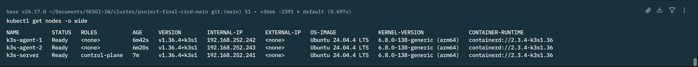
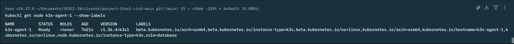
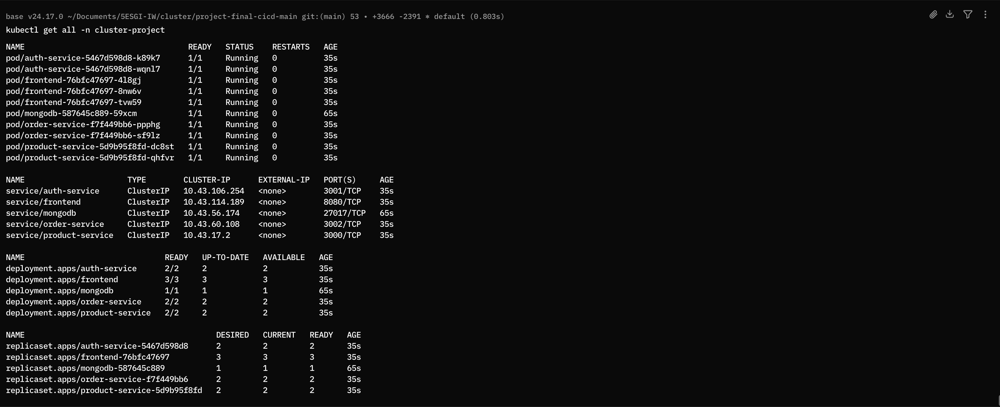

# Projet final - Clusterization de conteneurs

## Contexte:

L'objectif de ce projet est de déployer sur un cluster Kubernetes multi-nœuds une application web composé

- d'un fron-tend
- trois service back-end
- et une base de donnée

en assurant la haute disponibilité (réplication et répartition des pods), la sécurité (Secrets, HTTPS), la persistance
des données et la reproductibilité complète du déploiement.

#### Composants de l'application:

| Composant       | Rôle          | Replicas |
|-----------------|---------------|----------|
| frontend        | interface web | 3        |
| auth-service    | back-end      | 2        |
| product-service | back-end      | 2        |
| order-service   | back-end      | 2        |
| mongodb         | persistance   | 1        |

#### Stack utilisé:

- Multipass pour les trois VM Ubuntu 24.04 (1 control plane, 2 agents)
- k3s comme distribution Kubernetes
- Traefik en Ingress
- Docker Buildx pour les images multi-architecture
- Docker Hub

---

## Quick start

#### Prérequis:

- Multipass [Guide d'installation](https://canonical.com/multipass/install)
- kubectl [Guide d'installation](https://kubernetes.io/docs/tasks/tools/)
- Docker
- Node.js 18+

#### Étape 1: Créer le cluster

> À ignorer si vous disposez déjà d'un cluster Kubernetes. Passez à l'étape 2

```bash
./scripts/init-cluster.sh
```

Le script crée trois VM Ubuntu 24.04 via Multipass (k3s-server, k3s-agent-1, k3s-agent-2) leur attribue des adresses IP
fixes installe k3s sur le manager joint les deux agents à l'aide du token du manager puis applique le label
role=database à l'agent-1 pour déterminer le nœud sur lequel MongoDB sera planifié




#### Étape 2: Configurer kubectl sur la machine hôte

Adaptez d'abord le sous-réseau dans le script si le vôtre diffère de 192.168.252.0/24 vérifie avec

```bash
multipass list
```

puis

```bash
./scripts/k3s-kubeconfig.sh
```

cela vous permet d'exécuter les commandes kubectl depuis votre machine hôte important pour les étapes suivantes .

#### Étape 3: Construire et publier les images (optionnel)

> Les images sont publiées sur un dépôt Docker Hub public. Cette étape n'est nécessaire que pour reconstruire depuis les
> sources.

```bash
docker login
./scripts/build-and-push.sh
```

Le script construit les images en multi-architecture et les pousse sur le registre. Pour utiliser votre propre compte,
modifiez les variables dans le script .

#### Étape 4: Déployer l'application

```bash
./scripts/deploy.sh
```

Les manifests sont appliqués dans l'ordre de leurs dépendances : namespace, Secrets et ConfigMaps, volume et base de
données, services backend, frontend, puis Ingress. Le script attend que MongoDB soit disponible avant de déployer les
services qui en dépendent



#### Étape 5: Résoudre le nom de domaine

```bash
./scripts/set-dns.sh
```

Ajoute cluster-project.local au fichier /etc/hosts de la machine hôte, pointant vers l'adresse du manager

### Étape 6: Activer HTTPS

```bash
./scripts/configure-https.sh
```

Génère un certificat auto-signé avec OpenSSL, le stocke dans un Secret TLS et l'associe à l'Ingress

### Étape 7: Charger le jeu de données

```bash
./scripts/init-products.sh
```

Insère huit produits dans le catalogue

#### Accès

L'application est disponible sur https://cluster-project.local et toute requête HTTP est redirigée en HTTPS

---

## Architecture

| Nœud        | Rôle                     | Adresse         |
|-------------|--------------------------|-----------------|
| k3s-server  | control plane (manager)  | 192.168.252.241 |
| k3s-agent-1 | worker   (role database) | 192.168.252.242 |
| k3s-agent-2 | worker                   | 192.168.252.243 |

Trois VM Ubuntu 24.04 (2 vCPU, 2 Go) provisionnées par Multipass. Les adresses sont fixées en netplan pour que le join
des agents, le kubeconfig et la résolution DNS restent valides après un redémarrage.

#### Ressources déployées:

Toutes les ressources sont regroupées dans le namespace
`cluster-project` [00-namespace.yml](kubernetes/00-namespace.yml)

| Service         | Replicas | Port  |
|-----------------|----------|-------|
| frontend        | 3        | 8080  |
| auth-service    | 2        | 3001  |
| product-service | 2        | 3000  |
| order-service   | 2        | 3002  |
| mongodb         | 1        | 27017 |

Chaque workload dispose de son propre manifest contenant son Deployment et son Service [Kubernetes](kubernetes)

#### Persistance:

MongoDB utilise un PersistentVolumeClaim de 3 Gi sur la StorageClass local-path, montée sur /data/db.
qui assure que les donnée survie la suppression et le redémarrage du pod de MongoDB.

#### Manifests:

Les manifests sont numérotés par ordre de dépendance. Le préfixe détermine l'ordre d'application

| Ordre | Fichier                   | Ressources              | Rôle                                                                      |
|-------|---------------------------|-------------------------|---------------------------------------------------------------------------|
| 00    | `00-namespace.yml`        | Namespace               | Crée `cluster-project` namespace et applique les Pod Security Admission   |
| 10    | `10-secrets.yaml`         | 3 Secrets               | Identifiants MongoDB, URIs de connexion, clé de  JWT                      |
| 11    | `11-configmap.yaml`       | 2 ConfigMaps            | Variables d'environnement non sensibles et URLs internes des services     |
| 12    | `12-tls-secret.yaml`      | Secret TLS              | Certificat auto-signé et clé privée, généré par `configure-https.sh`      |
| 20    | `20-db-persistance.yml`   | PersistentVolumeClaim   | Réserve 3 Gi sur `local-path` pour les données MongoDB                    |
| 21    | `21-db.yaml`              | Deployment + Service    | MongoDB 7 sur le nœud `role=database`                                     |
| 30    | `30-frontend.yml`         | Deployment + Service    | Interface web, 3 replicas                                                 |
| 40    | `40-auth-service.yml`     | Deployment + Service    | Service d'authentification, 2 replicas                                    |
| 41    | `41-products-service.yml` | Deployment + Service    | Service catalogue, 2 replicas                                             |
| 42    | `42-orders-service.yml`   | Deployment + Service    | Service commandes, 2 replicas                                             |
| 50    | `50-ingress.yml`          | 4 Middlewares + Ingress | Redirection HTTPS, en-têtes de sécurité, compression, Rate limit, routage |

--- 

## Rapport des bonus: 

3 bonus ont été implémentés parmi les bonus proposées: 

####  Resource Requests & Limits + QoS:


**Fichiers :** `kubernetes/30-frontend.yml`, `40-auth-service.yml`, `41-products-service.yml`, `42-orders-service.yml`, `21-db.yaml`

Chaque conteneur déclare des `requests` et des `limits` CPU et mémoire exemple:

| Workload | CPU (req/lim) | Mémoire (req/lim) |
|---|---|---|
| `frontend`, services backend | 50m / 500m | 96Mi / 256Mi |
| `mongodb` | 100m / 1 | 256Mi / 1Gi |


#### Node Affinity / nodeSelector

**Fichiers :** `kubernetes/21-db.yaml`, plus les quatre manifests applicatifs

Contrainte stricte sur la base de données.Le provisionneur `local-path` de k3s écrit sur le disque local d'un nœud ; le volume n'est pas accessible depuis les autres. MongoDB est donc épinglé sur le nœud portant le label `role=database` :

```yaml
nodeSelector:
  role: database
```

####  Rolling Update

**Fichiers :** les quatre manifests applicatifs

```yaml
strategy:
  type: RollingUpdate
  rollingUpdate:
    maxUnavailable: 0
    maxSurge: 1
revisionHistoryLimit: 3
```